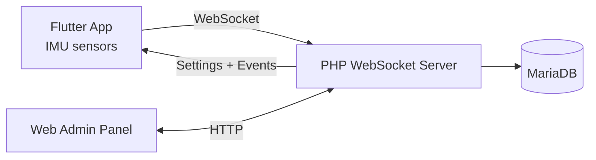

# Security Motion Tracker


Security Motion Tracker is a motion and security monitoring system built as the final project for the state-certified technician program at Otto Brenner School in Hannover.
It combines a Flutter mobile app (IMU sensors), a PHP WebSocket backend, a MariaDB database, and a web-based admin panel for device settings and event history.

## At a Glance
- Mobile device records accelerometer and gyroscope data plus battery and temperature.
- WebSocket backend ingests data, stores events, and broadcasts updates.
- Admin panel visualizes history and lets you tune thresholds and intervals.
- Docker Compose stack with MariaDB and phpMyAdmin.
- Documentation, diagrams, and CAD files included.

<figure>
  
  <figcaption>High-level system overview: device, backend, database, and admin panel.</figcaption>
</figure>

## Architecture


<figure>
  
  <figcaption>WebSocket connection states used by the backend and clients.</figcaption>
</figure>

## Components
### Mobile App (Flutter)
- Uses accelerometer and gyroscope readings to detect movement and rotation.
- Tracks battery level and device temperature.
- Displays local notifications for movement, battery, and connection warnings.
- QR code based onboarding and API key registration.

### Backend (PHP + Ratchet)
- WebSocket server for real-time sensor data and device registration.
- Event processing and persistence to MariaDB.
- Device settings are pushed back to the app.

### Admin Panel (Web UI)
- Device list and status.
- Settings such as thresholds, idle timeouts, and measurement intervals.
- Event history charting.

## Event Model
Events are stored as typed security signals in the backend:

| ID  | Event                       |
| --- | --------------------------- |
| 10  | Battery warning             |
| 11  | Battery empty               |
| 12  | Idling                      |
| 21  | Connection lost             |
| 22  | Connection timeout          |
| 30  | Acceleration limit exceeded |
| 31  | Rotation limit exceeded     |

Sensor messages sent from the app include:
`a` (acceleration magnitude), `r` (rotation magnitude), `tp` (temperature), `b` (battery).

## Getting Started (Docker)
1. Update environment variables in `src/server/config.env` for your network and database.
2. Start the stack from `src/server`:

```bash
docker compose --env-file config.env up -d
```

Ports:
- `80` Web UI (admin panel)
- `8080` WebSocket server
- `8888` phpMyAdmin

The compose file uses an ipvlan network with a static IP. Adjust `SERVER_IP`, `SUBNET`, `GATEWAY`, and `ETHERNET_ADAPTER` in `src/server/config.env` for your environment.

More walkthroughs are in the wiki:
https://github.com/CarlKuhligk/Security-Motion-Tracker/wiki/Getting-started

## Local Development
### Flutter App
```bash
cd src/app
flutter pub get
flutter run
```

### Backend
- WebSocket entry point: `src/server/bin/WebsocketServer.php`
- Database schema: `src/server/sql/tables.sql`


## Repository Layout
```
doc/                Diagrams, screenshots, and setup notes
src/app/            Flutter mobile app
src/server/         PHP WebSocket server + web admin + docker setup
src/cad/            CAD models for enclosures
```
